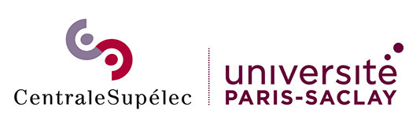

---

<h1 align="center">Hi 👋, I'm Clement Wang</h1>
<h3 align="center">Machine learning enthousiast and Master of Science Student (🎓 May 2024) from Paris, France 🇫🇷.</h3>

- 🌴 Currently living on the campus of the **University of Paris-Saclay**.
- 🎓Double Master of Science student: **MVA Maths, Vision, Learning at ENS Paris-Saclay** and **Data Science at CentraleSupélec**.
- 🔍 **Looking for a 6-month internship starting in April 2024**.
- 🧐 Passionate about anything related to learning algorithms.

<h3 align="left">Connect with me:</h3>

    
    
    

---

<h3 align="left">Languages and Tools:</h3>

- Programming Languages:
    

        
        
        
    

- Data Science:
    

        
        
        
        
        
        
    

- Techs:
    

        
        
        
        
        
        

    

---

<h3> My Deep learning beliefs </h3>

 

- Simpler is better
- If it does not work, there is a reason behind
- Theory unlocks imagination, experience brings intuition
- Theory is not enough, while testing takes time
- Solving a problem is not getting the best metric

 

<h3> Machine learning topics I worked on </h3>
 
 

Classical Machine Learning:
- Regression, SVM
- XGBoost, Light GBM, CatBoost
- SHAP values, Anchor, LIME

Computer vision:
- Image classification and regression
- GAN
- Perceptual loss, neural style transfer, super-resolution
- Object detection: RCNNs, YOLOs
- Semantic segmentation
- Key points detection
- Few shot learning

Text & Images
- CLIP, CLIP Seg, SAM
- Diffusion models: Stable diffusion, Dreambooth, ControlNet

NLP:
- Text classification
- LLMs fine-tuning, text generation

Speech:
- Voice activity detection
- Speech-to-text

Time series:
- DTW, dictionary learning
- Time series classification
- Breakpoint detection
- Adaptive Brownian bridge-based aggregation representation

Game Theory and RL:
- Monte Carlo, Q-learning, TD(0), SARSA 
- DQN, PPO
- PSRO

Other:
- Uncertainty estimation
- Spiking neural network
- Mixture density network

 

<h3> Projects overview </h3>
 
 

These projects are ordered chronologically. Not everything is related to AI. 

<h4> Student projects </h4>
 
 

As a student, I was still not sure what I wanted to do in my life. After a Bachelor's in maths, physics, and algorithmics I got into one of the best universities in France. That's when I started to try out different things...

<h5> Game Jam: 3D Horror Game </h5>

 

Game trailer|
:-----:|
 |

My very first group coding project with a team of 5 people. We designed and developed a 3D Horror Game on Unity in C# within 1 week.

I mainly worked on the interactions with the environment, the fighting gameplay, and mobs' behavior.

You can download the game [here](https://drive.google.com/file/d/1QAxTDq3LyYiQcaBdpUdU7sxK0e0sgb4l/view?usp=drive_link).

Unity, Blender, C#

<h5> French Robotic Cup </h5>
 
 

Our robot           | Photo of the playground
:-------------------------:|:-------------------------:
  |  

Building an autonomous robot that moves in a defined environment and moves objects within a team of 11 people in about one year.

We had a fixed camera outside of the game board. I worked on the localization of the robot, the detection of the objects and obstacles from the camera, and the transmission of this information. 

OpenCV, Python, Bluetooth

<h5> Medical data analysis with unsupervised methods </h5>
 
 

 

One-week project in collaboration with the Pasteur institute. Study of links between genes from reactions to different stimuli on R. 

R Studio, Unsupervised learning, PCA, Joint graphical lasso

<h5> Tabular data competition: Classification of buildings from geodata and metadata </h5>
 
 

Visualization of geo data|
:-----:|
|

Ranked 2nd over 72 in a course competition on tabular data competition. 

Tabular data, XGBoost, Feature engineering, Light GBM, CatBoost, Random forest

<h4> Automatants, AI student organization </h4>
 
 

[Automatants](https://automatants.cs-campus.fr/) is the AI student organization of CentraleSupélec. It promotes Machine learning at CentraleSupélec, gathering skills and sharing knowledge through courses, events, competitions, and projects. 

<h5> President of the association </h5>

 
From January 2021 to January 2022, I was the President of this student organization. It was probably the most fulfilling experience of my life. 20 people, tens of events, competitions, and so much fun.

Here are some images: 

<h5> GAN: Cat generator  </h5>
 
 

Generated cats|
:-----:|
|

This was my very first Deep learning personal project. The goal was to generate cat images. I got a dataset from the internet and I took my very first step in Deep learning.

I started with a simple DCGAN, then a GAN with residual connexions changed the loss to a Wasserstein loss, and at the end I trained Progressive GAN. I read the papers for Style GAN but did not implement it.

To make it public, I served it on the website of my association with Tensorflow JS. Try it [here](https://automatants.cs-campus.fr/projects/cat-generator).

Tensorflow, Keras, Tensorflow JS
GAN, Resnet, Progressive GAN, Wasserstein loss, Style GAN

<h5> Perceptual loss: Neural Style Transfer  </h5>
 
 

Neural Stryle Transfer Visualization|
:-----:|
|

After GANs, I got hooked on perceptual losses. The idea of designing a "perceptual loss" instead of using a pixel-wise loss was so interesting that I had to implement it. 

After implementing the vanilla version of neural style transfer, I wanted to have a quicker method to get stylish images so I implemented fast neural style transfer. It consists in using a generator network to directly transform an image to minimize perceptual loss. I managed to transfer style in real time from my camera. 

Tensorflow, Keras, OpenCV
Perceptual loss, Neural style transfer, Fast NST, VGG loss

<h5> Imbalanced classification </h5>
 
 

Visualization of the dataset|
:-----:|
|

Winning a competition on imbalanced image classification. This competition was the occasion to apply everything I learned in one year.

My best model was an ensemble of MobileNetv2 nets trained with semi-supervised learning and a lot of regularization (label smoothing, dropout, weight decay).

[Here](https://github.com/clementw168/Imbalanced-Quickdraw) is the repository of my code for more details.

TensorFlow, Keras
Imbalanced dataset, Resnet, MobileNetv2, ShuffleNetv2, Few-shot image classification, Semi-supervised learning, Regularization

 

<h5> Genetic algorithm for mazes </h5>
 
 

Visualization of the game|
:-----:|
|

This project solves a maze game only knowing the distance to the exit. When the game begins, the player has to provide a list of moves (right, left, top, right). Then the environment returns the distance to the exit after following the list of moves. 

I used a genetic algorithm to solve this game only for the sake of having fun with a genetic algorithm.

The corresponding repository is [here](https://github.com/clementw168/Genetic-Maze)

OOP, Genetic algorihtm, Pygame

 

<h4> ViaRézo, tech student association </h4>
 
 

[ViaRézo](https://viarezo.fr/) is the tech student association of CentraleSupélec. It provides internet access and many web services (mailing lists, VMs, social media, etc.) to more than 2000 students.

I joined this association at the same time as Automatants but I gradually left because of the lack of theoretical challenge. 

<h5> Website CI/CD - Gitlab </h5>
 
 

Creating CI/CD scripts on existing WebApps. Quality checkers, unit tests, automatic deployment.

Workflow, CI/CD, Gitlab, GitHub

<h5> Personal website</h5>
 
 

Create a simple website with a Node JS Backend, and "handmade" Frontend with HTML and CSS. Encapsulating it with Docker and deploying it on a VM. 

VM, Docker, Node JS, HTML, CSS

<h4> Paris Digital Lab - Digital Tech Year </h4>
 
 

After one and half years of studying general engineering, I wanted to discover the professional world so I started my one and half gap years.

My first internship was with the Paris Digital Lab, a tech consulting company as a Machine learning consultant. I did 3 projects of 7 weeks with different companies, each of them with a Minimal viable product at the end following Scrum methodology. 

Consulting was not my thing. Even though projects can be very different and challenging, most of the time, they were theoretically too simple and I had no right to choose what to work on.  

<h5> Confidential company, YoloV3 on radio wave detection </h5>
 
 

This project was about detecting and classifying radio signals in the IQ format. The IQ format is a time series of complex numbers, representing two orthogonal components of a radio signal.

A visualization of the Fast Fourier Transform of the signal was enough to convince us that Object detection was a good way to solve that problem. 

YOLOv3 achieved 0.95 mAP @ IOU 0.5 on the task.

Pytorch, YOLO, RCNN, Object detection, Unet, Semantic segmentation, signal processing

<h5> L'Oréal Research&Innovation, Retrieving lipstick from selfies </h5>
 
 

This project is about lipstick retrieval from a selfie. The approach is to first, find the lips with Face landmarks detection, then crop on these lips and predict the optical properties of the lipstick. From these properties, find the best fit in a database of lipsticks. 

I used Dlib out-of-the-box for the face landmarks detection. The regression task was made with a regression CNN. And then the matching was a weighted L2 score on optical properties.

The available data was generated with a GAN. For the colors, I had to move into the LAB space to have a perceptual distance. The client also wanted an estimation of the uncertainty for each prediction so I implemented [Deep evidential regression](https://arxiv.org/abs/1910.02600).

Tensorflow, Deep regression, Uncertainty estimation, Dlib

<h5> Oorion, Personalized object detection with CLIP </h5>
 
 

This one is an exploration of everything that can be done to personalize detected objects and add classes to YOLOv5 with the minimum amount of manual annotation. 

I did a huge literature review of Few-shot image classification, few-shot object detection, class agnostic detection, open-world object detection, CLIP, Referring expression comprehension.

The research in zero-shot learning got so hot at that time. I designed a solution with a class-agnostic detector and CLIP on top of it. It achieved 0.20 mAP on COCO. However, a few days before the end of my internship, [One for all](https://arxiv.org/abs/2202.03052) was released, and could do the same better and faster. 

Pytorch, Hugging face
Few-shot image classification, few-shot object detection, class agnostic detection, open-world object detection, CLIP, Referring expression comprehension

<h4> Polygon Technologies </h4>
 
 

Six months internship at Polygon. [Polygon](https://hellopolygon.com/) is a new kind of psychology practice that provides remote diagnostics for dyslexia, ADHD, and other learning differences. The company is based in Santa Monica, California, United States. 

<h5> Diagnostic assistance with AI </h5>
 
 

I worked on a project to assist diagnosis of learning differences. The global idea is that we record testing sessions of patients with a camera. 

From these videos, we extract all the useful information as time series. And then, we use these time series to understand what happened at what moment because of what. This approach gets rid of high-dimensional video data. At the same time, it makes the global pipeline much more interpretable which is so important in the medical field where mistakes can cost a lot.

Here is a list of key features I worked on:
- Unifying all the data on AWS Storage
- Data cleaning and standardization
- Voice activity detection with Gaussian mixture models
- 3D face landmarks detection with Face alignment nets
- Benchmarking speech-to-text solutions (Whisper, AWS Transcribe, ...)
- Setting up AWS Batch pipelines to optimize feature extraction costs
- Time series visualization with Plotly and Streamlit
- Time series classification and breakpoint detection

AWS, Docker, Pytorch, Steamlit, Plotly

Face landmarks detection, Voice activity detection, Speech-to-text, Time series classification, and breakpoint detection

<h4> Photogen AI </h4>
 
 

App trailer|
:-----:|
 |

I got inspired by my internship in a Start-up in the United States. At the same time, I got really interested in Generative AI. A friend of mine invited me to create Photogen AI. The idea was to sell AI-generated images of the customers. 

<h5> Dreambooth adaptation to realistic images </h5>
 
 

DreamBooth: Fine Tuning Text-to-Image Diffusion Models for Subject-Driven Generation (CVPR 2023) was published and a lot of AI avatar apps popped out of nowhere. However, no one could generate qualitative realistic images. We focused on that, and after a few tricks with Dreambooth, we got decent to really good results. 

In front of the Eiffel Tower| In front of the Kremlin | In Rome | Professional picture
:-----:|:-----:|:-----: | :-----:
| | | | 

Automatic 1111, Hugging face, diffusers
Dreambooth, Stable diffusion

<h5> Implementation of AWS infrastructure and costs optimization </h5>
 
 

AWS Dashboard|
:-----:|
|

Turning all tests on Google Colab to production on AWS. Creating dashboards and alerts to monitor errors.

Two production pipelines on AWS:
- Inference with dynamic autoscaling group with warmup. Automatic scaling based on the monitoring of the number of SQS messages. 
- Dreambooth fine-tuning with AWS Batch.

AWS, Docker, Fast API

<h5> Paris Gen AI Hackathon </h5>
 
 
One weekend competition on any technical subject related to Generative AI. 

I worked on how to decrease the number of required images for Dreambooth. It became a huge literature review and testing of the latest repositories on Pose Transfer, Instruct pix2pix, pictures light adaptation, Background matting, etc.

Visualization. Prompt: Wearing a red suit at Cannes|
:-----:|
|

<h5> Multi people image generation </h5>
 
 

A few weeks of work on group photo generation with personalized Dreambooth weights.

Here are some visualizations for the following prompts:

Positive: fantasy themed portrait of {token} with a unicorn horn party hat, vibrant rich colors, pink and blue mist, rainbow, magical atmosphere, drawing by ilya kuvshinov:1.0, Miho Hirano, Makoto Shinkai, Albert Lynch, 2D

Negative: pictures from afar, bad glance, signature, black and white pictures

Positive: digital oil painting of {token} (with a comically large head:1.2), big forehead, (fisheye:1.1), unrealistic proportions, portrait, caricature, closeup, rich vibrant colors, ambient lighting, 4k, HQ, concept art, illustration, ilya kuvshinov, lois van baarle, rossdraws, detailed, trending on artstation

Negative: bad glance, signature, pictures from afar, black and white pictures

| | | |
|-|-|-|
| | | |

CLIP Seg, Background Matting, ControlNet, Dreambooth

<h4> Stryker </h4>
 
 

Before coming back to the university, I decided to do another internship abroad. I got an opportunity at Stryker in Freiburg, Germany. 

I had the chance to work in the R&D department of a big company and also to try the medical field. I really liked the environment of a big company and the people I met there. I also enjoyed working in Medtech as I felt that my work had a real meaning in saving lives. 

You can consult my [internship report](assets/appendix/internship_stryker.pdf) and my [final presentation](assets/appendix/High%20Speed%20drill%20calibration.pptx).

<h5> 3D calibration of chirurgical tools </h5>
 
 

Getting the 3D calibration of surgical tools with a single video from a single RGB camera. Accelerating the pipeline from 2 minutes to 10 seconds. Reaching an error of 3.0 mm. 

High speed drill calibration pipeline|
:-----:|
|

See my [report](assets/appendix/internship_stryker.pdf) for more information. 

3D Computer vision, Key points detection, triangulation

<h5> Extremely accurate subpixel coordinate regression </h5>
 
 
Improving the estimation of centroids on blobs of light from 0.05 to 0.003 pixel error with Deep learning. 

<h4> Etandex </h4>
 
 

Right before coming back from Germany, I accepted a short mission of 2 months as a Freelance Data analyst at Etandex. 

The project consisted of predicting the potential of a commercial opportunity. The client wanted deep insights on how to explain the predictions of the algorithms. 

SHAP value summary plot|
:-----:|
|

XGBoost, SHAP value, LIME, Anchor

 

 A few facts about me 
 
 

- I was born Asian, grew up in a French environment and lived in the US and in Germany for 6 months.
- I am a sports addict: volleyball, bouldering, spikeball, running, biking...
- There is no fun if I don't aim for the best. Being competitive brings so much and it is ok not to be the best. 
- I love both spending my time reading philosophy in a silent park and partying with friends.
- One day, I was playing basketball to cool down after an exam. I slipped on a clementine and broke my ankle. Then I walked with crutches for 2 months. 

